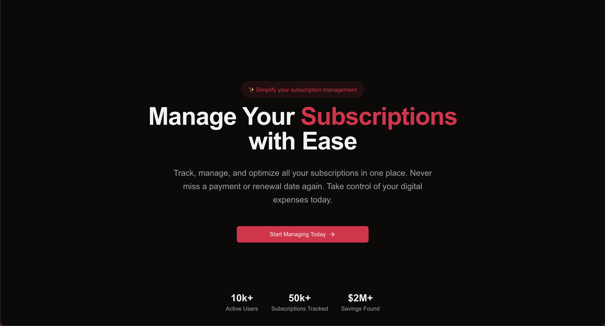
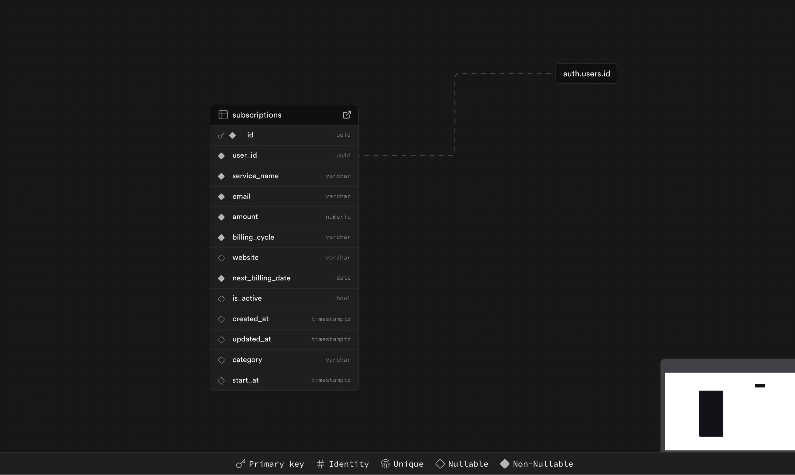

# 🔥 Subscriptions Manager

This is a subscription management web application built using Next.js 15, Supabase, and ShadCN UI. It features authentication via Google and Magic Link, along with customizable theme colors and dark mode support.

## Star ⭐ the repo if you like what you see😉.

## Features

- Next.js 15 with App Router
- Authentication (Google & Magic Link)
- Subscription management
- Theme customization
- Dark mode support

## Showcase

Here are some screenshots showcasing the web application:




## Prerequisites

Make sure you have the following installed:

- [Node.js](https://nodejs.org/) (LTS recommended)
- [Supabase account](https://supabase.com/)

## Installation

1. Clone the repository
2. Install dependencies:

   ```sh
   npm install
   ```

3. Set up environment variables:
   - Create a `.env` file in the root directory.
   - Add your Supabase credentials:

     ```env
     NEXT_PUBLIC_SUPABASE_URL=your-supabase-url
     NEXT_PUBLIC_SUPABASE_ANON_KEY=your-anon-key
     NEXT_PUBLIC_SITE_URL=http://localhost:3000
     ```

## Database Schema

Below is an image of the database schema used in Supabase:

